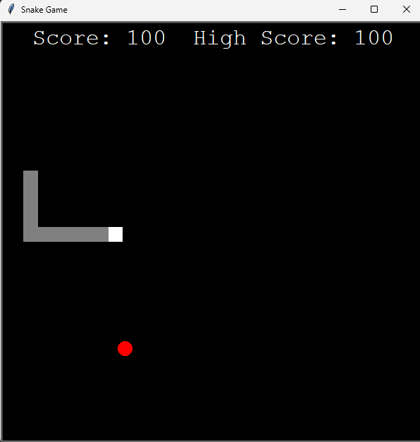
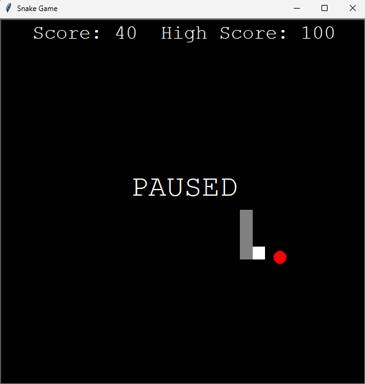

# Snake Game 🐍

A simple snake game implemented in Python using the `turtle` module. The game includes features like pausing, resuming, collision detection, and score tracking. Built for fun and learning purposes!

## Features 🎮

- **Classic Snake Gameplay**: Control the snake to eat the food and grow longer.
- **Border Collision Detection**: The game resets if the snake hits the border.
- **Self-Collision Detection**: The game resets if the snake collides with itself.
- **Pause and Resume**: Pause the game with `SPACE` or `ESC` and resume from the same state.
- **Score Tracking**: Displays your current score and keeps track of the high score.

## How to Play 🕹️

1. **Controls**:
   - Use the **arrow keys** to move the snake:
     - `↑` Up
     - `↓` Down
     - `←` Left
     - `→` Right
   - Press `SPACE` or `ESC` to **pause** or **resume** the game.

2. **Objective**:
   - Control the snake to eat the red food.
   - Each time the snake eats food, it grows longer, and your score increases.
   - Avoid hitting the borders or colliding with yourself.

3. **Scoring**:
   - Gain 10 points for each food eaten.
   - Try to beat your high score!

## Installation 🛠️

1. **Clone the Repository**:
   ```bash
   git clone https://github.com/Jesus-Almansa/Snake_Game.git
   ```
    ```bash
   cd snake-game
   ```

2. **Install Python**:
   Ensure you have Python 3.6 or later installed on your system. You can download Python [here](https://www.python.org/downloads/).

3. **Run the Game**:
   Simply execute the game script:
   ```bash
   python snake.py
   ```

## Screenshots 📸

### Game Running


### Game Paused


## How It Works 🧠

1. The game uses Python's `turtle` module to draw the snake, food, and display text.
2. The snake's movement and collision detection are handled in a game loop.
3. The `paused` state allows toggling the game without resetting the snake's state or score.

## Contributing 🤝

Contributions are welcome! Feel free to submit a pull request or suggest improvements.

## License 📜

This project is licensed under the MIT License. See the [LICENSE](LICENSE) file for details.

## Acknowledgments 🙏

- Built using Python's `turtle` module.
- Inspired by the classic Snake game.